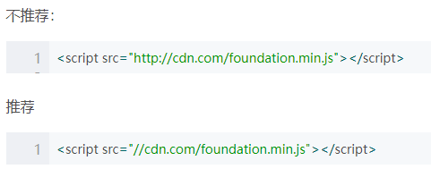

# 前端开发规范

## 命名规范

### 驼峰式命名法介绍

-   Pascal Case 大驼峰式命名法：首字母大写，例如：StudentInfo、UserInfo、ProductInfo
-   Camel Case 小驼峰式命名法：首字母小写，例如：studentInfo、userInfo、productInfo

### 【强制】文件资源命名

-   文件名不得含有空格；
-   文件名建议只使用小写字母，不使用大写字母。（为了醒目，某些说明文件的文件名，可以使用大写字母，例如 REAMAME、LICENSE）；
-   文件名包含多个单词时，单词之间建议使用半角的连词线（-）分隔；
-   引入资源使用相对路径，不要指定资源所带的具体协议（http:，https:），除非这两者协议都不可用

### 【强制】变量命名
* 命名方式：小驼峰式命名方法
* 命名规范：类型+对象描述的方式，如果没有明确的类型，就可以使前缀为名词

|类型	|小写字母|
|--|--|
|array	|a|
|boolean	|b|
|function	|fn|
|int	|i|
|object	|o|
|string	|s|

### 【强制】函数命名
* 命名方式：小驼峰式命名方法（构造函数使用大驼峰命名法）
* 命名规范：前缀为动词

|动词	|含义	|返回值|
|--|--|--|
|can	|判断是否可执行某个动作 |	函数返回一个布尔值。true：可执行；false：不可执行|
|has	|判断是否含有某个值	    |       函数返回一个布尔值。true：含有此值；false：不含有此值|
|is	    |判断是否为某个值	    |       函数返回一个布尔值。true：为某个值；false：不为某个值|
|get	|获取某个值	           |              函数返回一个非布尔值|
|set	|设置某个值	           |              无返回值、返回是否设置成功|

### 【强制】常量
* 命名方法：全部大写
* 命名规范：使用大写字母和下划线来组合命名，下划线用来分割单词

## 注释规范

### 【强制】单行注释
* 单独一行：//(双斜线)与注释文字之间保留一个空格
* 在代码后面添加注释：//(双斜线)与代码之间保留一个空格，并且//(双斜线)与注释文字之间保留一个空格。
* 注释代码：//(双斜线)与代码之间保留一个空格。

### 【强制】多行注释
* 若开始(/*和结束(*/)都在一行，推荐采用单行注释
* 若至少三行注释时，第一行为/*，最后行为*/，其他行以*开始，并且注释文字与*保留一个空格。

### 【强制】函数（方法）注释
* 函数(方法)注释也是多行注释的一种，但是包含了特殊的注释要求
语法：

* 常用注释关键字

推荐：

